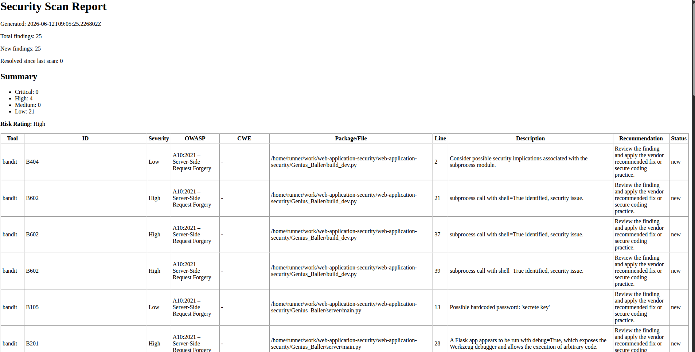

# Application Security Automation Framework

## Overview

This project provides an automated security scanning solution for web applications and source code repositories. It is designed to identify common security weaknesses, detect vulnerable dependencies, and generate comprehensive security reports as part of a CI/CD pipeline.

The scanner focuses on detecting vulnerabilities aligned with the OWASP Top 10 and secure coding best practices. It integrates multiple security analysis tools to provide actionable findings, severity ratings, remediation recommendations, and associated CVE information when available.

---

## Features

### Static Application Security Testing (SAST)

Detects common security issues, including:

* Hardcoded credentials and secrets
* Command injection vulnerabilities
* Insecure deserialization
* Debug mode exposure
* Cross-Site Scripting (XSS) patterns
* Unsafe code practices
* Misconfigurations and security anti-patterns

### Dependency Vulnerability Scanning

Analyzes project dependencies to identify:

* Known vulnerable packages
* Security advisories
* Associated CVEs
* Recommended package upgrades

### Automated Reporting

Generates detailed HTML reports containing:

* Vulnerability descriptions
* Severity classifications
* Affected files and locations
* CVE references
* Remediation recommendations

### CI/CD Integration

Designed to run automatically within GitHub Actions workflows, enabling continuous security validation throughout the development lifecycle.

---

## Technologies

* Python
* Bandit
* Semgrep
* pip-audit
* GitHub Actions

---

## Project Structure

This project demonstrates how security testing can be integrated into modern DevSecOps workflows by automating vulnerability detection and reporting directly within the software development pipeline.

---

## Use Cases

* Secure code reviews
* CI/CD security automation
* DevSecOps demonstrations
* Security training and education
* Portfolio projects for cybersecurity professionals

---

## Disclaimer

This project is intended for educational, research, and demonstration purposes. While it can help identify potential security issues, it should not be considered a replacement for professional security assessments or penetration testing.

---

## License

This project is released for educational and demonstration purposes.

# Future improvement
- DAST
- container scanning